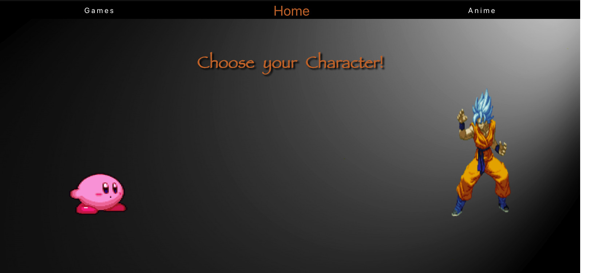
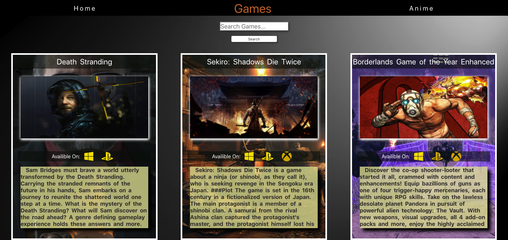
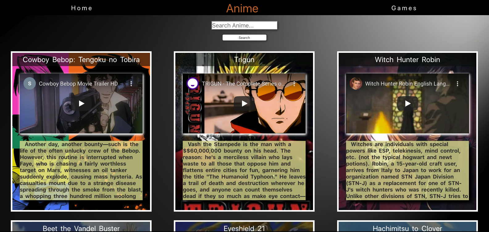

# SoulReapers - React

## Decription

Original Description: This Project was our first Front-End Project. Our Goal was to create a website to allow users to look up information on thier favorite Animes and Games. This was a Project where we allow ourselves to play with alot of different things that CSS can do by aiming at a younger and diverse audiance with a very fun UI.

## Motivation

Originally DigitalCrafts front-end Project using HTML, CSS, and JavaScript. The idea was to clean up the original design and make the pages more consitent with each other. I also wanted to maintain as much I could from the original idea.

## Screenshots

## Tech/framework used

<b>Framework</b>

- React

<b>Built with</bOriginal>

- [React Hooks](https://reactjs.org/docs/hooks-intro.html)
- [Yup](https://github.com/jquense/yup)
- [Formik](https://jaredpalmer.com/formik/)

## Tests

Tests are creating using:

- [Cypress](https://www.cypress.io/)
- [Jest](https://jestjs.io)

## Credits

Original Project: [Api-Plus-Ultra](https://github.com/Da-Colon/API-Plus-Ultra)

<b>Original Contributers:</b>

- [Kyrathedork](github.com/Kyrathedork)
- [GilliamD](github.com/GilliamD)

#### Anything else that seems useful

## License

A short snippet describing the license (MIT, Apache etc)

MIT © [David Colon](github.com/Da-Colon)
